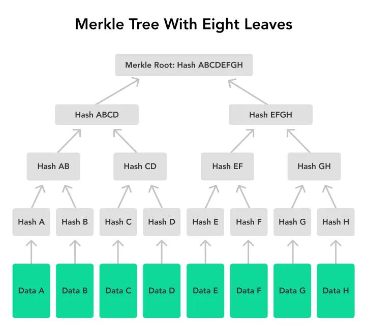
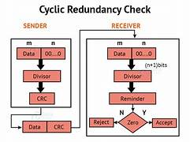

### Data Integrity Verification

  
   
  <em>Data Integrity Verification [<a href="https://www.reddit.com/r/ccna/comments/p4nbqu/about_hash_i_want_to_explain_and_see_my/">13</a>]</em>

#### Merkle trees

For effeciently verifying large sets of data merkle tree also known as hash trees can be used.Merkle trees, highly valued for its capacity to detect changes in data makes it a fundamental component in technologies that demand strong data verification mechanisms.

  
   
  <em>Figure 1: Merkle Trees [<a href="https://blockchain-academy.hs-mittweida.de/merkle-tree/">2</a>]</em>

[click for implementation](../codes/merkle_tree.md)

#### CRC(Cyclic Redundancy Check)

CRC is widely used for error detection on network devices for maitaining data integrity between the sender and the reciever.CRC is preferred in various applications such as in telecommunications, networking protocols and disk storage systems as it is simple and effecient to implement.

  
   
  <em>Figure 1: CRC flow [<a href="https://data-flair.training/blogs/error-detection-and-correction-in-computer-network/">3</a>]</em>

##### 1.Naive CRC

CRC using the naive appraoch will work efficiently for 8-bit data but for real time usually much greater than 8-bits it fails.

<b>Time Complexity:</b>O(data_length\*N)

[click for implementation](../codes/CRC/crc_naive.c)

#### 2.CRC using bit manipulation

<b>Time Complexity:</b>O(number of bits)

[click for implementation](../codes/CRC/crc_bits.c)

Both naive approach and bit manipulation are not efficient for real time applications.

#### 3.CRC using Lookup table

This works on the base that "the remainder remains the same for the same dividend and divisor".Hence,it can be precomputed for any fixed polynomial and store it in a lookup table.

<b>Time Complexity:</b>O(data_length)

[click for implementation](../codes/CRC/crc_lookup_table.c)

#### Comparision of the threee methods of CRC used

| **Aspect**         | **Naive**                                         | **Bit Manipulation**                       | **Lookup Table**                  |
| ------------------ | ------------------------------------------------- | ------------------------------------------ | --------------------------------- |
| **Approach**       | Basic CRC Calculation using manual XOR and shifts | Decimal-Binary Conversion Approach         | Lookup Table Optimization         |
| **Initialization** | Padding data with zeros, initializing check_value | Convert binary strings to decimal          | Precompute lookup table           |
| **Complexity**     | \( O(data_length\*N) \)                           | \( O(n) \)                                 | \( O(length) \)                   |
| **Efficiency**     | Less efficient for large data sizes               | Efficient but with higher constant factors | Highly efficient                  |
| **Use Case**       | Educational, understanding                        | Understanding CRC in both binary contexts  | Performance-critical applications |
