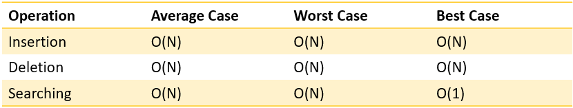

## IP routing

A Trie, also known as prefix tree which is a tree like data structure that can be used for efficient storage and retrieval of keys.It can be used in cyber security in IP routing for storing IP address for quick look-up.Here's my code for [trie](../codes/trie.cpp)

### Time Complexity of Trie

