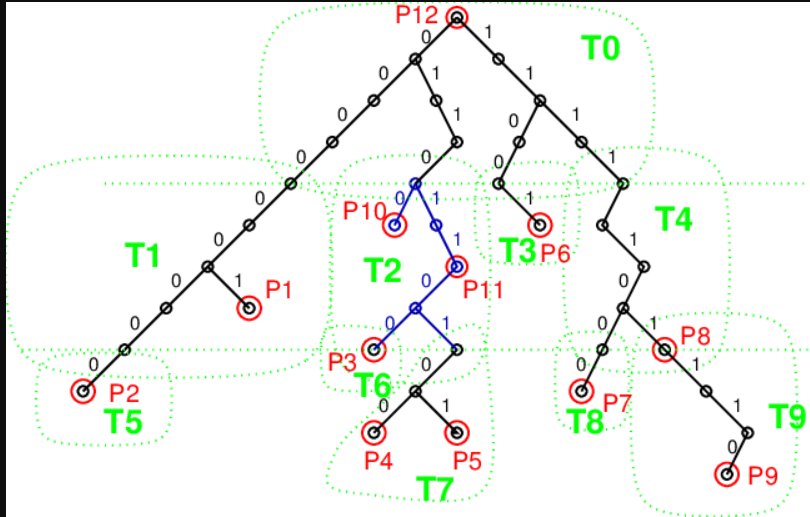

## IP routing

 
As IP address are stored in binary sequences Tries can be used for efficient storage and retrieval of these sequences where trie represents IP address.A Trie, also known as prefix tree which is a tree like data structure that can be used for efficient storage and retrieval of keys.It can be used in cyber security in IP routing for storing IP address for quick look-up.[code for trie](../codes/trie.cpp)

### Time Complexity of Trie

 
| Operation | Time Complexity | Auxiliary Space |
|------------|------------------|-----------------|
| Insertion | O(n) | O(n\*m) |
| Searching | O(n) | O(1) |

A further optimization could be possible using Radix trees.(Compressed Trie)

 
Comaparision of performance

  
   

