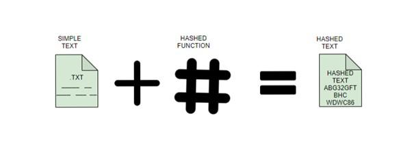

## Password Storage

Passwords are hashed before storing them in databases to enhance security.

  
   
  <em>Figure 1: Hashing [<a href="https://www.geeksforgeeks.org/sha-256-and-sha-3/">6</a>]</em>

### SHA-256 for password hashing

- SHA-256 can be used to hash user passwords.
- The hashed values are stored in a hash table, making it computationally expensive for attackers to reverse-engineer the original passwords.

#### SHA-256

- Stands for Secure Hash Algorithm, belongs to the family of the SHA-2 algorithms
- 256 indicating 256-bits irrespecitve of length of plain text.

code-<a href="https://github.com/kibonga/sha256-cpp">7</a>
