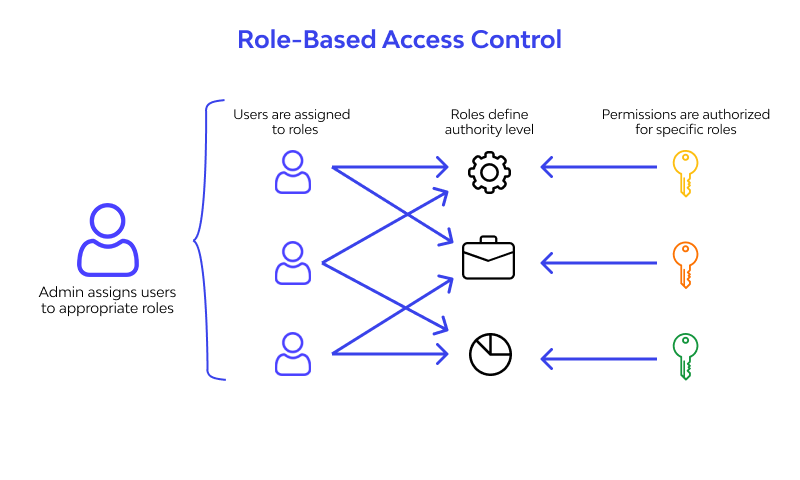
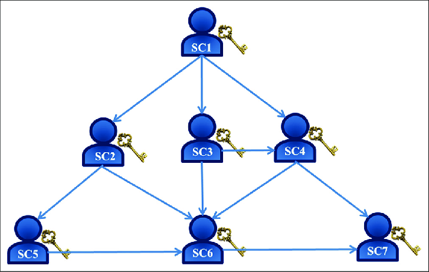

## Access Control

<ol>
<li><a href="#role-based-access-controlrbac">Role based Access Control</a></li>
<li><a href="#hirearchial-access-control">Hirearchial Access Control</a></li>
</ol>

### Role Based Access Control(RBAC):

In RBAC permissions are associated with roles and roles are assigned to users.

  
   
  <em>RBAC [<a href="https://leenahmad.github.io/advanced-js-reading-notes/24-Auth.html">9</a>]</em>

#### Data Structures used:

- Graphs
- Hash Tables

#### Algorithms Used:

- <b>Depth-First-Search(DFS)</b> and <b>Breadth-First-Search(BFS)</b>:Traverse role hirearchies to determine effective permissions for a user.

  [click for code and complexity analysis of dfs and bfs](../codes/Graph.md)

- <b>Djikstra's Algorithm</b>: Shortest path in permission hirearchies for least privilege access.

  [click for code and complexity analysis of Djikstra's](../codes/djikstra.md)

- <b>Topological Sort</b>:To resolve conflicts in permissions.

  [click for code of and complexity analysis Topological Sort](../codes/topo.md)

### Hirearchial Access Control:

Subset of RBAC with roles organized in hirearchy adding an extra layer of complexity.

  
   
  <em>HAC [<a href="https://www.researchgate.net/figure/The-structure-of-hierarchical-access-control-3_fig1_369772881">10</a>]</em>

#### Data Structures used:

- tree
- trie
- Directed Acyclic Graphs(DAG)

#### Algorithms

- <b>Depth-First-Search(DFS)</b> and <b>Breadth-First-Search(BFS)</b>:Traverse hierarchical structures to check or grant permissions.

  [click for code and complexity analysis of dfs and bfs](../codes/Graph.md)

- <b>Union-Find (Disjoint Set Union):</b>Manage connected components of users and their hierarchical permissions.

  [click for code and complexity analysis](../codes/union_find.md)
