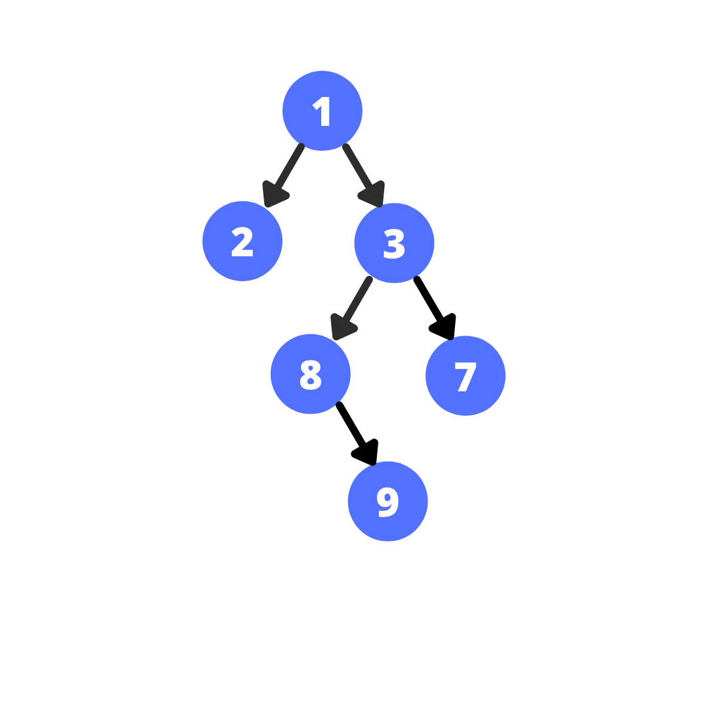

### Encryption Key Managment

  
   
  <em>Encryption key [<a href="https://dribbble.com/shots/3839034-Tech-Animation-7-2-Key-Encryption-V1">14</a>]</em>

#### Binary Search Trees

  
   
  <em>Bst [<a href="https://hub.batoi.com/dev21/introduction-data-structures-tree-60660d6769715">15</a>]</em>

- Binary search trees can be used in key management systems.
- In a binary search tree, each node represents an encryption key, and the tree structure allows for efficient search and retrieval of keys.
- As keys are sorted it is easy for retrieval.

[click for code](../codes/bst.md)
