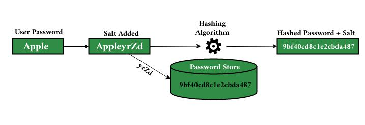

## Password Cracking Prevention

### Salted Password hashing

  
   
  <em>Salted Hashing [<a href="https://www.geeksforgeeks.org/what-is-salted-password-hashing/">8</a>]</em>

- It helps in improving password security.
- Each user is given a unique salt which is then combined with the password.
- These salted hashes are stored in hash table.
- Increases the difficulty for attackers, as it renders precomputed tables (like rainbow tables) ineffective against these uniquely salted hashes.

[<a href="https://www.geeksforgeeks.org/what-is-salted-password-hashing/">Explore Further[9]</a>]
