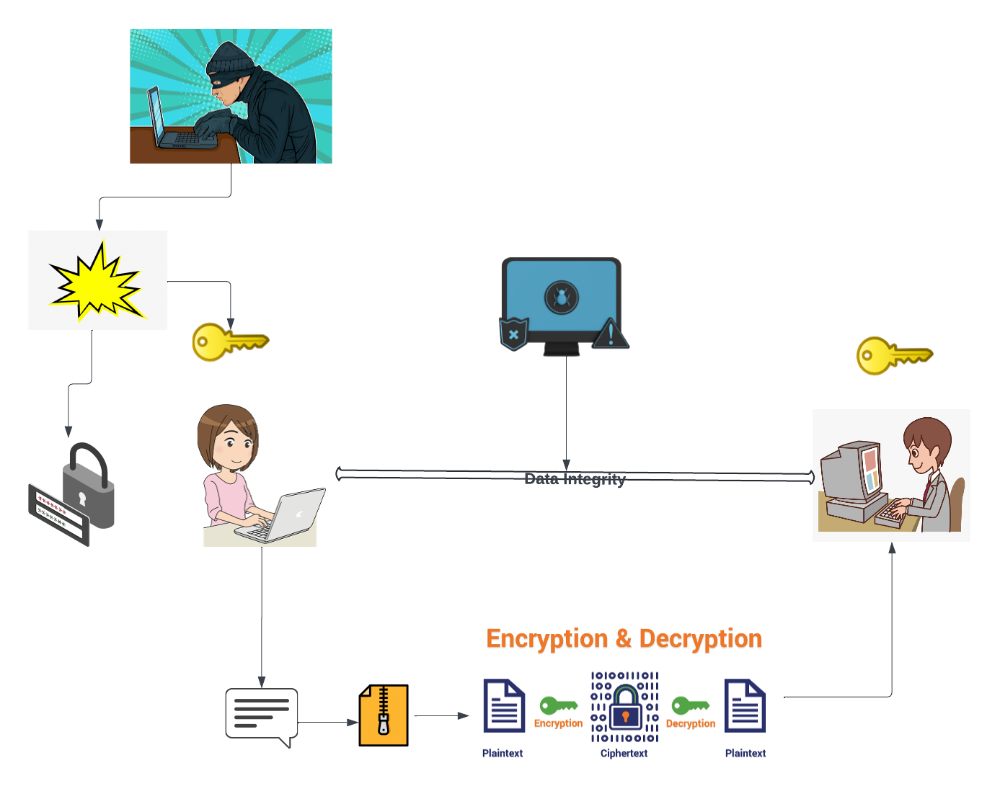
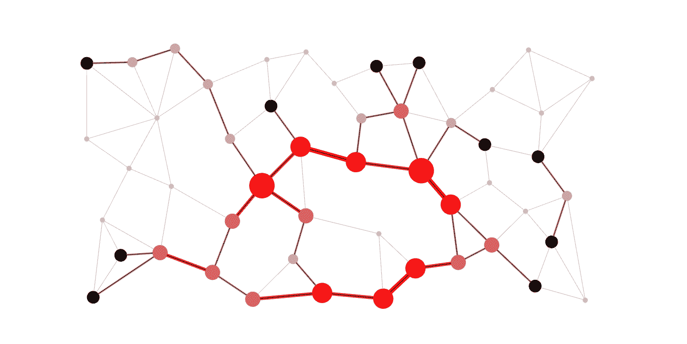
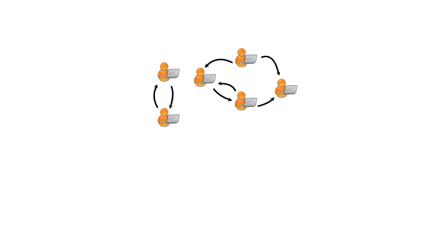
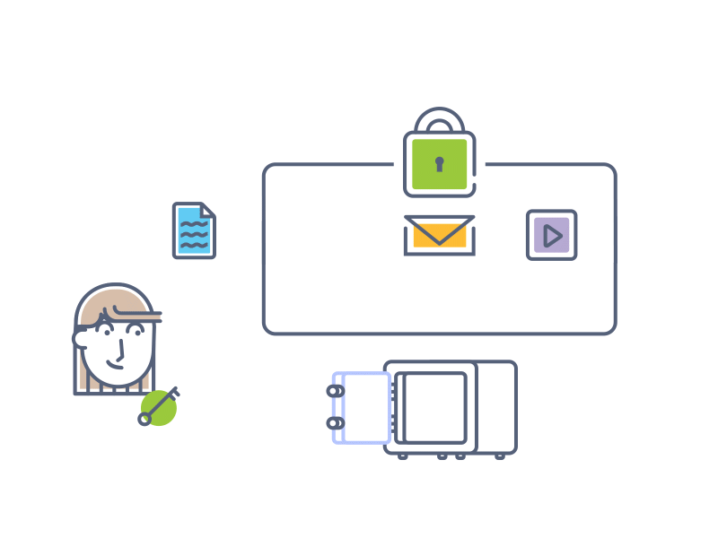

# 🔐Cyber Armor - Algorithmic Security🔐

---

### Course Overview

- **Course Name:** Algorithmic Problem Solving
- **Course Code:** 23ECSE309
- **Course Instructor:** Prakash Hegade

### About Me

- **Name:** Poonam M Shettar
- **USN:**01FE21BEC280
- **University:** KLE Technological University, Hubballi

---

## Cyber Security: Leveraging Data Structures and Algorithms

Welcome to my portfolio! Within this repository, you'll find my ideas and exploarations towards cyber-security utilizing data structures and algorithms.

  
   
  <em>Cyber-Security [<a href="https://www.esds.co.in/blog/top-5-cybersecurity-threats-to-dominate-2020/">17</a>]</em>

## Contents

1. [📖Introduction](#introduction)
2. [❓Why cyber-security](#why-cyber-security)
3. [🎯Objectives](#objectives)
4. [💼Use Cases](#use-cases)
5. [📜References](#refrences)

---

### Introduction

Cybersecurity is the practice of protecting computer systems, networks, and data from unauthorized access, attacks, and damage. It involves deploying measures like firewalls, encryption, and secure authentication to safeguard sensitive information. As digital threats continue to evolve, cybersecurity professionals constantly adapt and innovate to stay ahead. By detecting vulnerabilities, responding to incidents, and implementing preventive measures, they ensure the integrity, confidentiality, and availability of digital assets. In today's interconnected world, effective cybersecurity is essential for both individuals and organizations to mitigate risks and maintain trust in the digital ecosystem.

---

### ❓Why Cyber-Security?

In today's digital age, cybersecurity has become critically important as technology continues to advance. It's essential to ensure the security of digital systems and data against a growing array of cyber threats like malware and data breaches.

---

### Objectives

- Identify use cases governing cyber-security.
- Identify key algorithms, data structures, or system design techniques currently in use or with potential applications in enhancing Cyber-security.
- Create a resource to understand the intersection of data structures, algorithms, and real-world applications in cybersecurity.

---

### System Design

  
   
  <em>System Design </em>

### Use Cases

### 1.✅ Data Integrity Verification

Data integrity verification is important for protecting data from unauthorized access,corruption and other cyber threats.The verification guarantees data accuracy making organizations to confidently rely on information.It helps in ensurin the data remains consistent and unchanged by unauthorized entities throughout its lifetime.

  
   
  <em>Data Integrity Verification [<a href="https://www.reddit.com/r/ccna/comments/p4nbqu/about_hash_i_want_to_explain_and_see_my/">13</a>]</em>

<h4 style="color: red;">Challenges:</h4>

- Latency - Degradation of network performance.
- Computation Overhead.

<h4 style="color: green;">Market Benifits:</h4>

- Enhanced trust.
- Reputation protection of organizations.
- Risk Managment.

[Explore the detatils](Explanations/Data_integrity_verification.md)

---

### 2.📍 IP Routing

IP routing is crucial for cyber security by helping in correct forwarding of data packets across networks.It helps in traffic Managment,IP-spoofing and mitigating DDos attacks. Also,it enables network segmentation thereby reducing malware spread.

  
   
  <em>IP-routing[<a href="https://medium.com/generative-design/routing-with-graphs-5fb564b02a74">18</a>]</em>

<h4 style="color: red;">Challenges:</h4>

- Scalability- increasing network elemnts.
- Security Vulunerabilities.

<h4 style="color: green;">Market Benifits:</h4>

- Enhanced security
- Improved traffic managment.

[Explore the details](Explanations/IP_routing.md)

---

### 3.🔑 Key Generation for Encryption and Decryption

The strength of a network basically depends on the difficulty for the hacker to obtain the plain text from the cipher text.The strength of this cipher text often depends on the keys used.For any safe network it is critical to have a stronger key making it impossible for the hacker to hack.

  
   
  <em>Key [<a href="https://jtglez.github.io/CryptoCypher-Sprint01/index.html">19</a>]</em>

<h4 style="color: red;">Challenges:</h4>

- Stronger Unique inaccessible Key generation.

<h4 style="color: green;">Market Benifits:</h4>

- Secure Network with stronger keys.

[Explore the details](Explanations/key_generation.md)

---

### 4.🗜️ Data Compression

The primary goal of compression is in maintaining the integrity of the data/file while reducing its storage space.

- Compression before Encryption- An extra layer of security as encrypted data is not directly decipherable by malicious entities.
- Storage Optimization- reducing the high cost investment on disk space for cybersecurity companies which have vast amount of database.

  
   
  <em>Compression [<a href="https://leenahmad.github.io/advanced-js-reading-notes/24-Auth.html">11</a>]</em>

<h4 style="color: red;">Challenges:</h4>

- storage efficiency.
- Overhead for compression.

<h4 style="color: green;">Market Benifits:</h4>

Bandwidth optimization,Cost Reduction,Improved Performance,Enhanced security.

[Explore the details](Explanations/Data_compression.md)

---

### 5.🚦Network Traffic Analysis

Analysis of network traffic is critical for cyber-secuirty.It involves monitoring and examining data flowing across a network to detect anomalies, threats, and potential security breaches

  
   
  <em>Network traffic analysis [<a href="https://giphy.com/gifs/network-jpZvG8KmaVtF6">20</a>]</em>

<h4 style="color: red;">Challenges:</h4>

- handling large volumes of data.
- identifying sophiscated attack patterns.

<h4 style="color: green;">Market Benifits:</h4>

- Enhanced threat detection.
- mitigate risks effectively.

[Explore the details](Explanations/network_traffic_analysis.md)

---

### 6.🕵️ Intrusion Detection System

It helps in monitoring network or system activities for malicious activities.It can be used to avoid risks and maintain network integrity.

  
   
  <em>Intrusion Detection </em>

<h4 style="color: red;">Challenges:</h4>

- Complexity of threats-sophiscated and evolving attack techniques.
- Timely detection.

<h4 style="color: green;">Market Benifits:</h4>

- Early detection of cyber threats.

[Explore the details](Explanations/Intrusion_detection.md)

---

### 7.🛠️ Network Security and optimization

Network security becomes a major part of cyber security and to build these secure networks it is important to optimize networks for iddentifying critical nodes, improving security measures to build secure networks.

  
   
  <em>Network Security[<a href="https://www.hst.world/cyber-security/">21</a>]</em>

<h4 style="color: red;">Challenges:</h4>

- Complexity of Networks - diverse topologies and configurations.
- Development of security measures with network performance.

<h4 style="color: green;">Market Benifits:</h4>

- Improved reliability

[Explore the details](Explanations/Network_security_and_optimization.md)

---

### 8.🎮 Access Control

It regulates who can view what resources in a computing environment.It helps in preventing unauthorized access to data and resources thereby protecting sensitive information.

  
   
  <em>Access Control [<a href="https://dribbble.com/shots/5474610-secure-transactions">22</a>]</em>

<h4 style="color: red;">Challenges:</h4>

- Complexity in managment- With larger data resources become difficult to handle.
- scaling without performance degradation

<h4 style="color: green;">Market Benifits:</h4>

- Protecting sensitive information from unauthorised access.

[Explore the details](Explanations/access_control.md)

---

### 9.🔢 Secure Random Number Generation

Secure random number generation is important in context of cybersecurity to ensure integrity and confidentiality of sensitive systems and data.It involves producing unpredictable and unbiased numbers.It is essential in cryptographic protocolsa and secure communications.

  
   
  <em>Random Number [<a href="https://www.tpsearchtool.com/images/download-number-gif-generator-png-gif-base">23</a>]</em>

<h4 style="color: red;">Challenges:</h4>

- Cryptographic Strength-Ensuring resistance of generated numbers to predictive attacks.

<h4 style="color: green;">Market Benifits:</h4>

- Security in cryptographic operations such as encryption keys, digital signatures and secure communications.
- Reduce risk of cryptographic vulnerabilities.

[Explore the details](Explanations/Secure_rand_gen.md)

---

### 10.🦠 Malware Detection

The aim of malware detection is to identify and mitigate malicious software that can steal data and disrupt operations.It is one of the critical aspect of cybersecurity.

  
   
  <em>Malware [<a href="https://dribbble.com/shots/2417386-The-Hacker">24</a>]</em>

<h4 style="color: red;">Challenges:</h4>

- Increased latency, affecting system performance.
- Encrypted Malwares- difficult to identify.

<h4 style="color: green;">Market Benifits:</h4>

- Reduces risk of financial loss,operational disruption and reputational damage.
- Customer Trust.
- Can minimize system downtime.

[Explore the details](Explanations/Malware_detection.md)

---

### 11.🗝️Encrypttion Key Management

For any secure network it is critical to ensure keys are generated and stored securely throughout their lifetime.Effective key managment helps in preventing unauthorized access thereby mainatining integrity and confidentiality of data.

  
   
  <em>Encryption key [<a href="https://dribbble.com/shots/3839034-Tech-Animation-7-2-Key-Encryption-V1">14</a>]</em>

<h4 style="color: red;">Challenges:</h4>

- scalability- can be complex and resource-intensive.
- secure generation and storage of keys.

<h4 style="color: green;">Market Benifits:</h4>

- Protection of sensitive data from unauthorized access.

[Explore the details](Explanations/encryption_key_mgmt.md)

---

### 12.🏃‍♂️Unique Element Tracking

Used in threat intelligence systems for tracking unique items such as ip address or domain names.This helps faster response and mitigation by quick identification of new or previously unseen threats.

  
   
  <em>Threat Intelligence [<a href="https://www.bdigital.co.nz/antivirus/">25</a>]</em>

<h4 style="color: red;">Challenges:</h4>

- Handling large data.
- Integration with exxisting systems.

<h4 style="color: green;">Market Benifits:</h4>

- Enhanced Threat detection.
- Faster Response and mitigation of threats.

[Explore the details](Explanations/Unique_element_tracking.md)

---

### 13.🪜 Chronological event tracking in Audit logs

Audit-logs serve as critical information for mainatining chronological sequence of security related events.Maintaining a detailed recored of events can help in monitoring anamolies,detecting unauthorized activities to ensure integrity and security.

  
   
  <em> Chronological event tracking [<a href="https://www.pinterest.com/pin/animation-for-analytics-monitoring--9499849193998213/">26</a>]</em>

<h4 style="color: red;">Challenges:</h4>

- Managing and storing large volumes of audit log data efficiently.

<h4 style="color: green;">Market Benifits:</h4>

- Early detection of anamolies.
- Risk mitigation.

[Explore the details](Explanations/Chronological.md)

---

### 14.🪛Encryption and Decryption

Encryption plays a crucial role in cybersecurity by converting plain text to cipher text before transmission of message over a transmission medium.It ensures that information is accessible only to authorized users.It is critical for maintaining data integrity.

  
   
  <em>Encryption [<a href="https://www.host.co.in/blog/wp-content/uploads/2019/04/Encryption.gif">16</a>]</em>

<h4 style="color: red;">Challenges:</h4>

- Key Managment.
- Can lead to performance overhead.

<h4 style="color: green;">Market Benifits:</h4>

- Data security.
- Cloud security.
- Mobile and IOT security.

[Explore the details](Explanations/encryption.md)

---

### 15.#️⃣ Password storage

Password storage is an important part of cybersecurity.As,passwords contain sensitive information it is necessary to store them securely preventing unauthorized access.

  
   
  <em>Password storage [<a href="https://www.pinterest.com.au/pin/628674429212895416/">27</a>]</em>

<h4 style="color: red;">Challenges:</h4>

- Password managment and security

<h4 style="color: green;">Market Benifits:</h4>

- User security.
- Prevention of hacking

[Explore the details](Explanations/Password_storage.md)

---

### 16.⚡Password Cracking Prevention

Passwords must be securely stored making it difficult to crack password by unauthorized users.It is important to add additional layers to hashed passwords to protect and support onlu authorized access.

<h4 style="color: red;">Challenges:</h4>

- Secured password hashing

<h4 style="color: green;">Market Benifits:</h4>

- Enhanced security
- Improved performance

[Explore the details](Explanations/protected.md)

---

### Refrences

[1] M. Saračević, S. Adamović, and E. Biševac, "Application of Catalan Numbers and the Lattice Path Combinatorial Problem in Cryptography," _Acta Polytechnica Hungarica_, vol. 15, no. 7, pp. 91-106, 2018.

[2] lockchain Academy Mittweida, "Merkle Tree," accessed July 8, 2024. [Online]. Available: https://blockchain-academy.hs-mittweida.de/merkle-tree/.

[3] DataFlair, "Error Detection and Correction in Computer Network," DataFlair Training. [Online]. Available: https://data-flair.training/blogs/error-detection-and-correction-in-computer-network/.

[4] T. Talpey, "Storing and retrieving IP prefixes efficiently," APNIC Blog, June 4, 2021. [Online]. Available: https://blog.apnic.net/2021/06/04/storing-and-retrieving-ip-prefixes-efficiently/.

[5] "The trie lookup structure associated with the routing table given in Table 7," ResearchGate, [Online]. Available: https://www.researchgate.net/figure/The-trie-lookup-structure-associated-with-the-routing-table-given-in-Table-7_fig3_220770958.

[6] GeeksforGeeks, “SHA-256 and SHA-3,” GeeksforGeeks, [Online]. Available: https://www.geeksforgeeks.org/sha-256-and-sha-3/. [Accessed: Jul. 8, 2024].

[7] K. Kibonga, “sha256-cpp,” GitHub repository, 2024. [Online]. Available: https://github.com/kibonga/sha256-cpp.

[8] GeeksforGeeks, “What is Salted Password Hashing?,” GeeksforGeeks, [Online]. Available: https://www.geeksforgeeks.org/what-is-salted-password-hashing/.

[9] L. Ahmad, “Auth,” advanced-js-reading-notes, 2024. [Online]. Available: https://leenahmad.github.io/advanced-js-reading-notes/24-Auth.html. [Accessed: Jul. 8, 2024].

[10] ResearchGate, 2024. [Online]. Available: https://www.researchgate.net/figure/The-structure-of-hierarchical-access-control-3_fig1_369772881.

[11] J. Byers, “Compression Animation,” Dribbble, 2024. [Online]. Available: https://dribbble.com/shots/9723645-Compression-Animation. [Accessed: Jul. 8, 2024].

[12] “Huffman Coding in Synchronized Multimedia Integration Language,” WriteWork, 2024. [Online]. Available: https://www.writework.com/essay/huffman-coding-sychronized-multimedia-integration-language. [Accessed: Jul. 8, 2024].

[13] Reddit user, “About Hash I want to explain and see my...,” Reddit, 2024. [Online]. Available: https://www.reddit.com/r/ccna/comments/p4nbqu/about_hash_i_want_to_explain_and_see_my/. [Accessed: Jul. 8, 2024].

[14] Fowler Creative™, “Tech Animation 7- 2 Key Encryption V1,” Dribbble, Sep. 28, 2017. [Online]. Available: https://dribbble.com/shots/3839034-Tech-Animation-7-2-Key-Encryption-V1. [Accessed: Jul. 8, 2024].

[15] Batoi, "Introduction to Data Structures: Tree," 2021. [Online]. Available: https://hub.batoi.com/dev21/introduction-data-structures-tree-60660d6769715. [Accessed: Jul. 8, 2024].

[16] Host.co.in, "Encryption.gif," 2019. [Online]. Available: https://www.host.co.in/blog/wp-content/uploads/2019/04/Encryption.gif. [Accessed: Jul. 8, 2024].

[17] ESDS, "Top 5 Cybersecurity Threats to Dominate 2020," ESDS, Dec. 24, 2019. [Online]. Available: https://www.esds.co.in/blog/top-5-cybersecurity-threats-to-dominate-2020/. [Accessed: Jul. 8, 2024].

[18] B. O'Sullivan, "Routing with Graphs," Medium, Feb. 12, 2020. [Online]. Available: https://medium.com/generative-design/routing-with-graphs-5fb564b02a74. [Accessed: Jul. 8, 2024].

[19] J. T. Gonzalez, "CryptoCypher - Sprint 01," GitHub Pages, 2021. [Online]. Available: https://jtglez.github.io/CryptoCypher-Sprint01/index.html. [Accessed: Jul. 8, 2024].

[20] Giphy, "Network GIF," Giphy, Dec. 15, 2017. [Online]. Available: https://giphy.com/gifs/network-jpZvG8KmaVtF6. [Accessed: Jul. 8, 2024].

[21] HST, "Cyber Security," HST World, 2024. [Online]. Available: https://www.hst.world/cyber-security/. [Accessed: Jul. 8, 2024].

[22] E. Jones, "Secure Transactions," Dribbble, Dec. 14, 2018. [Online]. Available: https://dribbble.com/shots/5474610-secure-ransactions. [Accessed: Jul. 8, 2024].

[23] TP Search Tool, "Download Number GIF Generator," TP Search Tool, 2024. [Online]. Available: https://www.tpsearchtool.com/images/download-number-gif-generator-png-gif-base. [Accessed: Jul. 8, 2024].

[24] P. Jackson, "The Hacker," Dribbble, May 4, 2016. [Online]. Available: https://dribbble.com/shots/2417386-The-Hacker. [Accessed: Jul. 8, 2024].

[25] B. Digital, "Antivirus," B Digital, 2024. [Online]. Available: https://www.bdigital.co.nz/antivirus/. [Accessed: Jul. 8, 2024].

[26] Pinterest, "Animation for Analytics Monitoring," Pinterest, 2024. [Online]. Available: https://www.pinterest.com/pin/animation-for-analytics-monitoring--9499849193998213/. [Accessed: Jul. 8, 2024].

[27] Pinterest, "Home Automation - Pinterest," Pinterest, 2024. [Online]. Available: https://www.pinterest.com.au/pin/628674429212895416/. [Accessed: Jul. 8, 2024].

[28] Saračević, M., Adamović, S., & Biševac, E. (2018). Application of Catalan numbers and the lattice path combinatorial problem in cryptography. Acta Polytechnica Hungarica, 15(7), 91-110.
